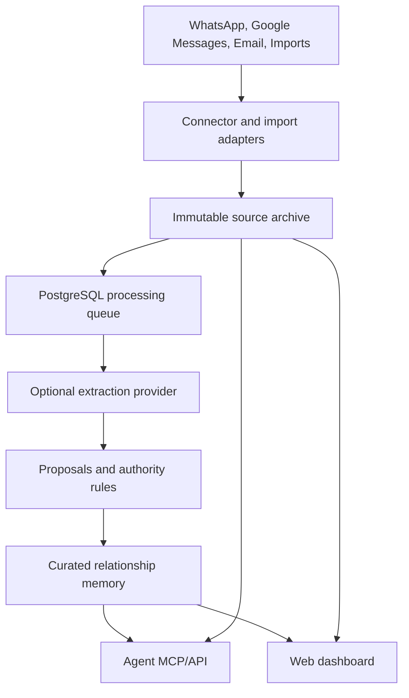

# Montauk

**Phase 2 Build and Migration Specification**

*Montauk — relationship memory for personal agents.*

Specification date: September 8, 2026  
Status: Approved design direction; implementation specification for migrating the Phase 1 codebase.

> **Implementation brief.** This document is intended to be given to Claude Code together with the existing repository and the Phase 1 as-built specification. Implement Phase 2 as a migration of the working Phase 1 system, not as an unrelated rewrite. Preserve user data and permanent person IDs, introduce the new architecture in testable stages, and do not declare the migration complete until the required automated test suite passes.

## 1. Executive Summary

Phase 2 turns Montauk from an agent-maintained Markdown relationship store into a self-hosted relationship-memory service with:

- a mobile-responsive web dashboard;
- a PostgreSQL canonical database;
- inbound, read-only source connectors for WhatsApp, Google Messages, and email;
- durable text transcript storage and idempotent imports;
- optional low-cost LLM extraction and on-demand summarization;
- human and agent review workflows;
- OAuth-style agent connection plus manual token fallback;
- workspace-scoped data and authorization designed for later multi-tenancy;
- encrypted backups, revision history, audit trails, cost controls, and easier deployment; and
- a verified one-time migration from the Phase 1 Markdown deployment.

Montauk remains relationship memory, not an autonomous assistant. It remembers personal information, relationships, and meaningful interactions. It does not send messages, reply on connected channels, create reminders, infer commitments, or maintain action lists.

The canonical database changes from Markdown to PostgreSQL. Markdown remains an export format and the original Phase 1 data directory remains an immutable migration backup. There is no permanent dual-write path.

## 2. Normative Language and Decision Authority

The words **must**, **must not**, **should**, and **may** are normative.

Where this specification delegates a technical choice, the implementation may select the option that best fits the existing codebase, but it must document the choice and meet the observable behavior and tests in this document. In particular, implementation may choose Baileys or whatsmeow for WhatsApp after a short, documented compatibility spike.

If the Phase 1 implementation conflicts with this specification, this specification governs Phase 2. Phase 1 MCP tool-name and request-schema compatibility is not required. Data integrity, permanent person IDs, and migration correctness are required.

## 3. Product Goals

1. Give the owner and authorized agents a durable, searchable memory of people in the owner's life.
2. Let the owner maintain the database primarily through an agent without making dangerous changes easy to perform accidentally.
3. Capture both sides of selected WhatsApp, Google Messages, and email conversations without ever sending through those channels.
4. Retain source text so extraction can be audited, retried, and improved.
5. Use an optional, user-configured LLM to turn new messages into conservative fact proposals and to generate purpose-specific summaries.
6. Continue providing useful storage, editing, deterministic retrieval, lexical search, and local vector search when no LLM is configured.
7. Make a fresh self-hosted deployment approachable through Docker Compose and a first-run web setup wizard.
8. Establish workspace isolation, roles, capabilities, and schema conventions that can support a multi-tenant Phase 3 without a data-model rewrite.
9. Provide a safe, reportable, reversible migration from Phase 1.

## 4. Explicit Non-Goals for Phase 2

- Sending, replying, reacting, marking read, deleting, or editing messages on connected services.
- Task extraction, commitments, reminders, follow-up lists, calendars, or action lists.
- Automatic creation of people from connectors or imports.
- Storing images, audio, video, documents, or other binary attachments.
- OCR, image understanding, or media summarization.
- A mobile companion application. The dashboard must instead be responsive on mobile browsers.
- Microsoft Graph / Microsoft 365 email integration.
- Hosted multi-tenant billing and account administration.
- Exposing the full future human-role UI; Phase 2 exposes one owner account per deployment/workspace.
- Arbitrary fact categories or per-person extraction policies.
- Defining or automatically inferring `connection_level`.
- Outbound notifications or connector webhooks to agents. Agents poll Montauk.
- Silent use of any hosted model or silent fallback between model providers.

## 5. Architectural Invariants

1. **PostgreSQL is canonical.** Markdown, JSON, search indexes, and generated summaries are derived or export artifacts.
2. **Source and memory are distinct.** Immutable transcript messages are evidence; curated person fields, facts, relationships, and interactions are relationship memory.
3. **Connectors are inbound only.** Connector code must expose no application operation capable of sending or changing remote messages.
4. **Nothing attaches to an unknown person automatically.** People are created only by a human in the dashboard or an authorized agent API call.
5. **Authority is enforced in the database/service layer.** Prompts may explain policy but cannot be the only enforcement.
6. **Every tenant record is workspace-scoped.** No service query may depend on the application having only one workspace.
7. **Messages are archived before extraction.** Ingestion must not depend on LLM availability.
8. **Automatic extraction is conservative and lowest authority.** It cannot overwrite human- or agent-curated values.
9. **One agent mutation call affects at most one person.** Cross-person bulk mutation and merge operations are dashboard-only.
10. **No sensitive content in routine logs.** Operational observability uses IDs, counts, timing, and status.

## 6. Target System Overview



Recommended deployable components:

- **Web/API process:** dashboard, MCP endpoint, OAuth authorization, REST/internal API, health endpoints.
- **Worker process:** connector synchronization, scheduled extraction, manual processing jobs, backup jobs, and index maintenance.
- **PostgreSQL:** canonical data, durable job state, authorization records, and full-text search.
- **Connector sidecars where required:** a minimal Baileys/whatsmeow and Google Messages bridge if those libraries do not fit the primary Python process.
- **Reverse proxy:** Caddy in the public deployment profile for automatic HTTPS.

Use PostgreSQL-backed jobs and advisory locks unless measurements prove a separate queue such as Redis is necessary. Avoid adding mandatory infrastructure without a demonstrated need.

## 7. Workspace and Ownership Model

A **workspace** is a collection of records about multiple people, together with its source accounts, transcripts, settings, human memberships, and agent credentials.

Phase 2 user-visible behavior:

- The first-run wizard creates one workspace and one owner.
- One or more agents may access that workspace.
- The UI need only expose the owner human role in Phase 2.

The schema and authorization layer must nevertheless support multiple workspaces and these future human roles:

| Role | Intended future authority |
| --- | --- |
| Owner | Workspace deletion, members, credentials, billing, configuration, and all data. |
| Admin | Configuration, connectors, agents, reviews, and all relationship data. |
| Editor | People, transcripts, reviews, interactions, and summaries. |
| Viewer | Read-only access to permitted workspace data. |

Requirements:

- Every tenant-owned row must include `workspace_id` directly or inherit it through a mandatory, unambiguous parent whose access is verified in the same query.
- Unique constraints must normally include `workspace_id`.
- Service methods must require a workspace context; repository methods must not offer unscoped list/get operations.
- Tests must create at least two workspaces and attempt cross-workspace reads and writes for every sensitive resource family.
- The design should remain compatible with later PostgreSQL row-level security, even if Phase 2 uses service-layer enforcement first.

## 8. Canonical Data Model

The exact table names may vary, but the implementation must represent the following entities and relationships.

### 8.1 Core identity and authorization

- `workspaces`
- `users`
- `workspace_memberships`
- `agent_clients`
- `agent_credentials` / OAuth grants
- `sessions`
- `authorization_codes` and short-lived confirmation records

### 8.2 Relationship memory

- `people`
- `person_aliases`
- `person_contact_methods`
- `facts`
- `fact_sources`
- `relationships`
- `interactions`
- `interaction_sources`
- `record_revisions`
- `review_proposals`

Preserve the Phase 1 person fields and semantics:

| Field | Phase 2 rule |
| --- | --- |
| `person_id` | Permanent `P[0-9]{4,}` ID, unique within workspace, immutable, never reused. |
| `name` | Required mutable display name; not split into first/last. |
| `aliases` | Normalized for comparison while preserving display spelling. |
| `birthday` | Partial precision supported. |
| `location` | Free text. |
| `company` | Current company. |
| `job_title` | Current job title. |
| `desired_contact_cadence_days` | Optional. |
| `summary` | Short stored profile summary for identification/UI; not authoritative over facts. |
| `contact` | Current email, phone, address, and messaging identities. |
| `archived_at` | Normal lifecycle removal; archived people remain recoverable. |

Keep the six Phase 1 fact categories exactly:

1. Family
2. Work & Education
3. Interests
4. Relationship with User
5. Life Events
6. General Notes

Keep variable-precision dates and `high`, `medium`, `low` epistemic confidence. `connection_level` remains optional and semantically undefined.

### 8.3 Source archive

- `connector_accounts`
- `source_identities`
- `source_threads`
- `thread_participants`
- `thread_person_links`
- `source_messages`
- `message_events`
- `import_runs`
- `processing_runs`
- `processing_cursors`
- `processing_jobs`

A source thread may map to many people, and a person may map to many identities and threads. The actual sender identity must remain attached to each message.

### 8.4 Settings and operations

- `workspace_settings`
- `model_configurations`
- `secret_references` or encrypted secret records
- `summary_cache`
- `audit_events`
- `backup_runs`
- `schema_migrations`
- `legacy_migration_runs`

### 8.5 Identifier policy

Preserve existing Phase 1 person IDs and the high-water mark. Allocate future IDs transactionally per workspace. Fact and interaction IDs may retain their existing human-facing values for migrated records; new database primary keys may be UUIDs or sortable IDs, but public IDs must remain stable and scoped to their person/workspace.

## 9. Source Message Model and Immutability

Each stored message must contain enough information to establish provenance and deduplicate future sync/imports:

- workspace, connector account, source platform, and source thread;
- provider message ID when available;
- provider sender identity and mapped person when confirmed;
- direction relative to the connected owner account (`inbound` or `outbound`);
- source timestamp and ingestion timestamp;
- normalized textual content plus, where appropriate, retained original textual representation;
- reply/thread identifiers when available;
- import/sync provenance;
- processing state and version; and
- content fingerprint used only as a fallback dedupe key.

Rules:

- Stored message text is immutable. The dashboard cannot edit it.
- Provider edits and deletions are recorded as message events. Montauk preserves the content originally received unless the owner permanently deletes it.
- The owner may correct participant mappings, thread mappings, source timestamps, and import metadata without altering message text.
- The system must be able to identify every fact and interaction derived from a message or processing run.
- Deleting evidence does not silently delete curated facts. The UI must warn that facts may remain and show their now-missing source state.
- Text transcripts are retained indefinitely by default, subject to explicit owner deletion and backup retention.

### 9.1 Attachment policy

Montauk must not download or store binary attachments. Images, audio, video, files, stickers, and embedded email resources are out of scope. A connector may store a minimal non-content placeholder needed to preserve conversation order, such as attachment type and `content_omitted=true`, but must not retain the binary, thumbnail, remote-resource payload, or extracted content. Text captions supplied as part of the message text may be retained.

Phase 3 may add OCR or media summarization without retaining originals.

## 10. Connector Framework

Define a provider-neutral inbound connector interface. A connector should implement:

- account setup and credential/session lifecycle;
- capability reporting;
- thread and participant discovery;
- incremental message synchronization;
- explicit historical synchronization;
- durable cursor/checkpoint handling;
- connection health and actionable error status;
- rate/backoff handling; and
- disconnect/reconnect without deleting stored data.

Connectors must be independently restartable and idempotent. A crash after storing messages but before advancing a cursor must cause harmless re-delivery, not duplication.

### 10.1 Read-only enforcement

Montauk is a passive archive at the product layer:

- Do not register tools, routes, jobs, or bridge methods that send, reply, react, mark read, delete, edit, or otherwise mutate a remote conversation.
- Use a restricted wrapper around any underlying library that has write capabilities.
- Add static/interface tests proving the Montauk connector abstraction exposes only discovery, receive, sync, status, and disconnect operations.
- The dashboard and agent API must use the term **inbound connector** and clearly state that Montauk never replies.

### 10.2 Selection before content storage

Connectors may discover and retain minimal thread metadata needed for selection. They must not persist or process transcript content until the owner explicitly enables the thread or an applicable address rule.

Before enabling, show participant identities, thread name, platform, and an estimated available date/message range when the provider supports it. Do not send unenabled content to an LLM.

On enablement, offer:

- future messages only;
- messages since a chosen date; or
- all available history (**default**).

Show an estimated message count before historical ingestion when possible.

Disconnecting an account stops future ingestion but retains its stored transcripts and extracted memory. Deletion is a separate, explicit workflow.

## 11. WhatsApp Connector

Implement WhatsApp as an optional linked-device connector using either:

- **Baileys** in a small TypeScript sidecar; or
- **whatsmeow** in a small Go sidecar.

Claude Code should perform a time-boxed spike against both choices and record the decision in an architecture decision record. The decision should prioritize maintenance status, protocol compatibility, session durability, history sync behavior, container complexity, resource consumption, and testability. It must not alter the product contract.

Requirements:

- Pair by QR code through the dashboard.
- Store linked-device session secrets encrypted.
- Ingest incoming and outgoing textual messages.
- Discover individual and group threads and identities.
- Respect explicit thread selection and history window.
- Preserve provider message IDs and sender identities.
- Surface session expiry, logout, sync lag, and reconnect instructions.
- State prominently that the connector relies on an unofficial linked-device implementation and may break when WhatsApp changes its protocol.
- Provide a manual WhatsApp export importer as a fallback.

Do not describe the connector as using Meta's business messaging API; that API does not represent the owner's ordinary personal chat history for this design.

## 12. Google Messages Connector

Implement Google Messages/SMS as an optional linked-device connector using a maintained Google Messages web/linked-device library or protocol implementation. A mautrix-gmessages-compatible approach may be used if it meets the requirements; the exact dependency must be validated during implementation and documented.

Requirements:

- Pair through the dashboard using the same user-visible mechanism as Google Messages for web where technically available.
- Ingest both sides of SMS, MMS, and RCS conversations, but persist text only.
- Treat media as omitted attachments under Section 9.1.
- Discover conversations and identities before content enablement.
- Preserve source IDs/cursors and reconnect safely.
- Label the connector unofficial/experimental and isolate it behind the generic connector interface.
- Do not couple the core schema to Google-specific identifiers so future texting connectors can be added.

There is no Phase 2 mobile app. If a reliable linked-device library cannot meet the acceptance tests, keep the adapter and UI behind an experimental feature flag, document the blocker, and ensure the rest of Phase 2 remains deployable.

## 13. Email Connectors

Phase 2 supports:

1. Gmail via OAuth and the Gmail API.
2. Generic IMAP for receiving and sent-mail synchronization.

Microsoft Graph is deferred.

Requirements:

- Ingest both received and sent messages.
- Retain provider thread/message IDs and relevant RFC message headers for threading and dedupe.
- Store original textual email content after removing binary/embedded resources and unsafe remote-resource references.
- Store a normalized plain-text representation for search and LLM processing.
- Detect and mark signatures and quoted prior messages so extraction can prefer newly authored text without destroying the source archive.
- Sanitize all HTML before dashboard rendering. Never execute scripts or load remote images automatically.

### 13.1 Address-based selection

When the owner confirms that an email address belongs to a person, future direct correspondence with that address is eligible for automatic ingestion. Requirements:

- Per-thread include/exclude overrides.
- Mailing lists, automated mail, and large-recipient threads require explicit thread enablement.
- A newly observed address may suggest a person mapping but cannot confirm one.
- Removing an address rule stops future automatic inclusion; it does not delete stored messages.

## 14. Identity and Thread Mapping

Identity mapping is many-to-many:

- a person may have many source identities and threads;
- a thread may involve many people;
- a source identity may be reused or ambiguous; and
- group messages must retain the actual sender.

When a connector observes a phone number, email address, or handle that exactly matches an existing contact method, Montauk may suggest that mapping. A human must confirm connector-originated mappings before extraction can attach facts to that person.

Agents may create people through the agent API and may manage a single person's source identity mappings when authorized, but they must search first and surface possible duplicates. Connectors and extraction jobs must never create a person.

Unknown identities remain unresolved. Their message text may remain in an enabled thread, but no fact or interaction may be attached to a person until the relevant mapping is confirmed.

For facts about a known person who is mentioned but is not a participant, extraction may create only a review-required proposal. It must not create the person and must require strong identity evidence.

## 15. Manual Imports and Deduplication

Dashboard imports must support:

- WhatsApp text exports (`.txt` and `.zip`, ignoring media);
- email `.mbox` files; and
- a documented normalized Montauk JSON or JSONL format.

Before commit, show a preview containing detected source, date range, participants, candidate thread/person mappings, message count, omitted attachments, ambiguous parse count, and estimated duplicates.

Deduplication order:

1. Stable provider message ID within provider account/thread.
2. Exact normalized identity, timestamp, and content fingerprint.
3. A conservative provider-specific fallback for exports lacking IDs, using normalized sender, timestamp tolerance, normalized text, and adjacent-message overlap.

Fuzzy dedupe must favor preserving a possible duplicate over deleting a distinct message. Flag uncertain cases in the import report.

Every import run records file hash, parser version, counts, warnings, and committed message IDs. Importing the same file repeatedly must be idempotent. Importing a larger transcript later must add only messages not already stored.

## 16. LLM Provider and No-LLM Mode

### 16.1 Provider interface

Implement a provider-neutral interface for extraction and summarization. Support:

- a low-cost hosted provider configured with the owner's API key;
- an OpenAI-compatible base URL for user-run services such as Ollama or llama.cpp; and
- separate extraction and summarization model settings, even when both initially use the same provider/model.

Do not bundle model weights or require local inference hardware. Do not enable a hosted provider merely because a key is present in the environment. Configuration must be an explicit owner action.

### 16.2 Behavior without an LLM

Montauk must remain operational when no LLM is configured:

- dashboard, people/fact/interaction editing, agent reads/writes, lexical search, and local vector search work;
- connectors and imports archive enabled text messages normally;
- messages enter `awaiting_processing` and extraction pauses;
- the dashboard prominently shows that extraction is paused and displays backlog size;
- `prepare_person_context` returns deterministic evidence selected from curated memory and permitted transcript excerpts;
- generated summaries return an explicit `generated=false` / `llm_unavailable` status and may include the deterministic evidence packet; and
- configuring a model makes the backlog eligible for later processing.

There must be no silent heuristic fact extraction and no silent provider fallback.

### 16.3 Cost controls

Provide:

- monthly token and/or spend limit;
- maximum job/batch input size;
- pause/resume control;
- per-run and monthly usage totals;
- estimated cost for pending and full-history work where pricing metadata is configured; and
- a hard stop when the limit is reached while ingestion continues.

When exact provider cost is unknown, label an estimate as unavailable rather than inventing one.

## 17. Extraction Policy

Extraction may produce proposals for:

- structured person fields;
- facts in the fixed categories;
- explicit relationships;
- meaningful interactions; and
- additions of source provenance to existing memory.

It must not produce tasks, reminders, commitments, action lists, diagnoses, psychological judgments, predictions, or unsupported relationship claims.

Extraction context must be limited to:

- the new message batch;
- confirmed participant-to-person mappings;
- concise relevant fields/facts for those people;
- minimal owner identity needed to resolve first-person references; and
- a small number of preceding messages needed for conversational meaning.

Never send unrelated people or the full workspace to the model. Never combine unrelated conversations in one prompt.

Extraction should accept direct statements and straightforward implications. It must preserve uncertainty in wording and confidence. Jokes, sarcasm, quoted material, speculation, forwarded statements, and third-party claims require extra caution.

### 17.1 Interaction aggregation

Create at most one summarized interaction per person, thread, and local calendar day for meaningful communication. Do not create interactions from mailing-list messages, obvious automation, unanswered promotions, or trivial reactions. The source messages remain available regardless of whether an interaction is created.

## 18. Processing Schedule and Job Semantics

Messages are stored immediately. Automatic extraction runs once per day at a configurable workspace-local time.

Batching rules:

- group by thread and bounded time window/day;
- never mix unrelated threads;
- split oversized inputs at message boundaries;
- use a durable processing cursor/version;
- be safe to retry after any partial failure; and
- catch up after downtime without duplicating proposals, facts, or interactions.

Manual processing:

- Dashboard: process pending for one person, one thread, or all pending.
- Authorized agent: trigger pending processing through the agent API. This is an operational request, not permission to mutate unrelated people directly.
- Full-history reprocessing: dashboard-only admin operation with a confirmation warning, affected-message preview, conflict warning, and cost estimate where possible.
- On-demand summaries: run immediately and separately from the daily extraction schedule.

Processing runs must record model/provider identity, prompt/schema version, source range, counts, usage, outcome, and error category without logging message text.

## 19. Review Policy

Expose two independent workspace settings.

### 19.1 Which proposals need review

`review_threshold`:

| Value | Behavior |
| --- | --- |
| `automatic_all` | Default. Eligible extraction results are incorporated automatically unless another rule mandates review. |
| `review_uncertain` | High-confidence results may apply automatically; lower-confidence results require review. |
| `review_all` | Every extracted change requires review. |

Mandatory-review rules, such as a third-party fact or authority conflict, override `automatic_all`.

### 19.2 Who may review

`allowed_reviewers`:

| Value | Behavior |
| --- | --- |
| `human_only` | Default. Only the owner/dashboard may approve or reject. |
| `human_or_authorized_agent` | Owner or an agent with `review_proposals` capability may decide. |

Agents poll rather than receiving unsolicited messages. The API must provide pending count, list/filter, proposal detail, supporting excerpts (subject to permissions), approve, and reject operations. Human approval creates owner-curated authority; agent approval creates agent-curated authority.

## 20. Authority, Conflict, and Revision Model

Authority order:

1. `owner_curated` — dashboard edits and human-approved proposals.
2. `agent_curated` — direct agent edits and agent-approved proposals.
3. `automatically_extracted` — automatically applied extraction results.

Each mutable field/fact/relationship/interaction must record its current authority and provenance. The service layer must enforce:

- Dashboard edits may change any relationship-memory value.
- Normal agent writes may change agent-curated and automatically extracted values.
- Extraction may change only automatically extracted values.
- A lower-authority conflict creates a proposal; it never overwrites the current value.
- New source evidence may be attached to a protected fact without changing its text, subject to dedupe and provenance rules.

### 20.1 Intentional agent override of owner-curated data

An appropriately capable agent may override owner-curated data only through a two-step flow:

1. `request_protected_change` validates the proposed single-person mutation but does not apply it. It returns a before/after diff, affected authority, warnings, expected record version, and a short-lived confirmation ID.
2. The agent presents that exact change to the user.
3. After the user confirms, `confirm_protected_change` applies it only if the confirmation is unexpired, belongs to the same agent/workspace/user context, and the expected record version still matches.

Confirmation tokens must be single-use and auditable. Automated extraction cannot invoke this path.

### 20.2 Revision history

Store append-only, field-level revisions indefinitely rather than duplicating complete records. Record old/new values, timestamp, actor type and ID, authority, reason when supplied, workspace, and processing/import source where applicable.

The dashboard must show history and allow restoring an earlier value. Restore creates a new revision; it never erases history.

## 21. Agent Authorization and Mutation Boundaries

Agent credentials use named, revocable capabilities. At minimum define:

- `memory_read`
- `memory_write`
- `review_proposals`
- `process_pending`
- `transcript_read`
- `protected_override`
- `single_person_delete` if implemented for agents

`transcript_read` is disabled by default. Ordinary read access returns curated memory and summaries/evidence, not unrestricted raw transcripts. Supporting excerpts returned for review must respect this capability or a narrowly scoped review grant.

Agent mutation rules:

- One call may atomically write multiple fields/facts/interactions for one person.
- A call cannot mutate multiple people. Agents use separate calls.
- Merge, bulk multi-person changes, and large-scale archive operations are dashboard-only.
- Full-history reprocessing is dashboard-only.
- Security administration—human users, connector credentials, other agent credentials, backup restore, and workspace deletion—is dashboard-only.
- Dangerous changes to one person use the protected two-step flow when authorized.

## 22. Agent Connection Workflow

### 22.1 Preferred browser authorization

The preferred flow is OAuth-style dynamic authorization:

1. The user enters the Montauk MCP URL in an agent host.
2. The host opens a browser to Montauk.
3. The owner signs in to the dashboard if necessary.
4. Montauk shows the requesting client and requested capabilities.
5. The owner approves or narrows the capabilities.
6. Montauk issues the client credentials/tokens and redirects according to the supported protocol.

Use current MCP authorization conventions supported by the selected SDK. Bind redirect URIs and state/PKCE securely. Do not ask the user to copy a generated configuration block in the preferred flow.

### 22.2 Manual token fallback

The dashboard must also create a named agent credential with selected capabilities. Show the raw token once, support revoke/rotate, and provide copy-ready examples for common MCP hosts containing the server URL and token placement. Never store the raw token after creation; store an appropriate hash.

Phase 2 may break the Phase 1 MCP tool surface. Publish clear server instructions and complete descriptions/schemas on every tool so a newly connected agent can discover correct use.

## 23. Suggested Phase 2 Agent Tool Surface

Exact names may change, but all behavior must be discoverable and typed.

### 23.1 Read and search

- search/resolve people with evidence and ambiguity
- get person overview
- get facts, relationships, interactions
- prepare purpose-specific context
- generate purpose-specific summary
- birthday and contact-cadence queries
- list archived people
- get connector/processing health without secrets

### 23.2 Single-person maintenance

- create person with possible-duplicate results
- update structured fields/name/aliases/contact methods
- add/update/remove facts and relationships
- add/update/remove interactions
- atomic one-person batch
- archive/restore one person
- manage confirmed source identities/thread links for one person
- request and confirm a protected change

### 23.3 Review and processing

- pending review count/list/detail
- approve/reject one or a bounded set of proposals for one person
- process pending for a person or thread
- process all pending as an operational command if capability is granted
- inspect processing status

### 23.4 Transcript access

With `transcript_read` only:

- search messages by person/thread/date/source
- get bounded excerpts
- get a thread page with cursor pagination

Do not expose connector setup secrets, bulk deletion, full-history reprocessing, merge, or multi-person bulk mutation to agents.

## 24. Search and Summaries

### 24.1 Search

Provide:

- deterministic exact/contact lookup;
- PostgreSQL full-text/substring search;
- local semantic search using the existing Phase 1 embedding behavior or a clean compatible abstraction; and
- transcript full-text search with strict workspace and transcript permissions.

The Phase 1 local embedding provider may remain the default. The implementation may move vectors to pgvector or retain a rebuildable local vector index. The choice must preserve lexical-only degradation, model fingerprinting, rebuildability, and evidence-bearing results. Vector storage is derived; PostgreSQL relationship data and transcript text are canonical.

### 24.2 Summaries

Keep a short stored profile summary for identification and the dashboard. Generate purpose-specific summaries on demand from curated memory and only the relevant, permitted transcript excerpts.

Generated summaries:

- are cache entries, not authoritative facts;
- record model/schema version and evidence references;
- invalidate when relevant memory/transcript mappings change;
- never create tasks or commitments; and
- clearly report when an LLM is unavailable, returning deterministic evidence instead.

## 25. Web Dashboard

The dashboard must be mobile-responsive and accessible by keyboard. It must include clear empty, loading, error, and degraded states.

### 25.1 First-run setup wizard

The first visit to an uninitialized deployment guides the owner through:

1. Create owner credentials (email or username plus password).
2. Create/name the initial workspace.
3. Confirm public/base URL and deployment profile.
4. Optionally configure LLM extraction and summarization.
5. Optionally connect WhatsApp, Google Messages, Gmail, or IMAP.
6. Choose daily extraction time and review settings, using documented defaults.
7. Configure/confirm encrypted daily backups.
8. Connect the first agent through browser authorization or create a manual token.

Two-factor authentication is deferred. Use strong password hashing, secure sessions, CSRF protection, login rate limits/lockout, and secure cookies.

### 25.2 Home page

Show:

- people count;
- upcoming birthdays;
- overdue contacts;
- pending reviews;
- unprocessed/failed messages;
- connector health and last sync;
- LLM configured/paused/limit status;
- last extraction run; and
- last successful backup.

### 25.3 People directory

Search and filter by name, alias, contact information, company, location, archive state, and semantic query. Surface duplicate names without collapsing identities.

### 25.4 Person page

Each person has a dedicated page with:

- overview and structured fields;
- facts grouped by the six categories;
- relationships;
- interactions;
- connected identities, accounts, and threads;
- transcript browser/search;
- pending proposals and supporting evidence;
- revision history and restore;
- pending-processing state and Process Now;
- full-history reprocess with warning/preview (dashboard only);
- per-person Markdown and JSON export; and
- archive, restore, and permanent-delete actions appropriate to permissions.

### 25.5 Transcript pages

Support paginated full-text search/filter by source, account, thread, participant/person, direction, and date. Show which facts/interactions cite a message and which processing run produced them. Support explicit deletion of selected messages or whole threads with impact warnings.

### 25.6 Settings and administration

Include:

- workspace/general settings;
- connector setup, selection, sync, reconnect, and disconnect;
- model/provider settings and cost controls;
- daily processing schedule;
- review policy;
- agent clients/tokens/capabilities/revoke/rotate;
- backup configuration/status/restore documentation;
- imports and exports; and
- health/migration diagnostics.

## 26. Deployment and Operations

### 26.1 Docker Compose

Ship an official Docker Compose deployment with persistent volumes and health checks. A minimal deployment should require only Docker/Compose, a domain or private-network address, and generated secrets. Components should start in dependency order and recover after restart.

Provide two documented profiles:

- **Private:** bind to localhost/LAN and support Tailscale or equivalent private access.
- **Public:** Caddy reverse proxy with automatic HTTPS and a configured public base URL.

The wizard should detect obvious callback/base-URL mismatches. Refuse or prominently block OAuth/credential setup over plain public HTTP; permit HTTP only for loopback/private development with an explicit warning.

### 26.2 Configuration

Non-secret settings live in PostgreSQL or a mounted config file as appropriate. Secrets must come from a mounted secret/master key or environment variable and must be encrypted at the application layer when stored in PostgreSQL.

Avoid hidden configuration split-brain. The dashboard must indicate which settings require an environment/container restart and which are live.

### 26.3 Backups

Provide built-in daily encrypted PostgreSQL backups with:

- configurable schedule and retention;
- a mounted output directory;
- success/failure and last verified backup in the dashboard;
- documented restore and test-restore procedure; and
- backup encryption using a key distinct from ordinary database credentials where practical.

Off-server copying may be documented but is not required. Explain that privacy-deleted content may remain in retained backups until those backups expire.

### 26.4 Exports

On-demand dashboard exports are sufficient; no scheduled Markdown mirror is required.

- Person export: human-readable Markdown and structured JSON.
- Workspace export: people, relationships, interactions, transcripts, mappings, provenance, and revision/audit history in a portable archive.
- Exclude passwords, sessions, OAuth refresh tokens, connector secrets, API keys, and raw agent tokens.

## 27. Security and Privacy Requirements

- Encrypt connector sessions, OAuth/IMAP credentials, and LLM API keys at application level using a master key supplied outside PostgreSQL.
- Use HTTPS for non-loopback access, secure cookies, CSRF protection, state/PKCE, password hashing, and bounded sessions.
- Add rate limiting and temporary lockout for failed authentication; this was deferred from Phase 1 and is required now.
- Hash manual agent tokens and show the raw value only once.
- Scope every authorization decision by workspace and actor capability.
- Never log transcript text, fact text, email bodies, credentials, prompts, or model responses by default.
- Sanitize HTML and prevent remote-resource loading and stored XSS.
- Validate upload types and sizes; stream imports and reject archive traversal/decompression bombs.
- Enforce connector content filtering before transcript persistence and before LLM dispatch.
- Use database roles/network isolation and volume protections appropriate to self-hosting.
- Field-level encryption of all transcripts/person records is not required in Phase 2 because it conflicts with search, but keep secret encryption and key access behind abstractions that can evolve to per-workspace keys.

## 28. Audit and Operational Logging

Maintain two distinct histories:

1. **Relationship revision history:** sensitive field-level changes visible to the owner and used for restore.
2. **Operational audit log:** actor ID/type, action/tool, resource IDs, status, timestamp, latency, and non-sensitive counts.

Operational logs must not contain message or fact content. Audit all authentication, connector lifecycle, import, review, protected override, archive/delete, backup restore, and security-administration actions.

Permanent privacy deletion should erase identifying audit payloads when required while retaining a minimal non-identifying statement that a deletion operation occurred.

## 29. Archive and Deletion Semantics

- Archive/restore is the normal person lifecycle.
- Permanent deletion requires explicit confirmation and a preview of affected identities, mappings, transcripts, derived memories, revision entries, and backup caveats.
- Dashboard owners may permanently delete.
- If agent single-person deletion is implemented, require both `single_person_delete` and the protected two-step confirmation flow.
- Bulk archive/delete and multi-person deletion are dashboard-only.
- Offer a deliberate choice between deleting the person record while retaining/unlinking transcripts and deleting linked transcript data as well, subject to shared-thread warnings.
- Never delete a message shared with another person's evidence without showing the cross-person effect.
- Do not automatically delete curated facts when their source transcript is deleted; mark provenance unavailable and warn.

## 30. Migration from Phase 1

### 30.1 Migration principles

- Migration is one-time, explicit, dry-runnable, backed up, verified, and resumable or safely restartable.
- The Phase 1 Markdown directory remains untouched after a pre-migration snapshot/backup. It is not dual-written after cutover.
- PostgreSQL becomes canonical only after validation succeeds.
- Preserve permanent person IDs and advance the per-workspace high-water mark beyond every imported ID.
- API compatibility is not a migration goal. Existing agents may need to reconnect and rediscover the Phase 2 tool surface.

### 30.2 Data to preserve

For active and archived people preserve:

- person ID, display name, aliases, structured fields, contact data, and archive state;
- all fixed-category facts, dates, confidence, sources, and related person references;
- all interactions, dates, channels, summaries, connection level, and sources;
- the person ID allocator high-water mark; and
- enough original-path/content-hash metadata to produce a migration report.

Phase 1 Git history is not imported as live revision rows. Retain the original data directory and Git repository as the historical archive. New Phase 2 edits use database revision history.

### 30.3 Credential transition

Do not make Phase 2 completion depend on preserving the old MCP interface. The preferred migration flow requires the owner to reconnect the agent using Phase 2 browser authorization or a new manual token. Revoke or retire old credentials after a clear migration notice. If importing old token hashes is trivial and safe, it may be offered as an explicitly temporary compatibility option, but it is not required and must not bypass new workspace scoping/capability mapping.

### 30.4 Migration command/workflow

Provide a CLI and dashboard-aware migration path similar to:

```text
montauk migrate-phase2 --source-data-dir PATH --workspace NAME --dry-run
montauk migrate-phase2 --source-data-dir PATH --workspace NAME --execute
montauk verify-phase2-migration --migration-id ID
```

Exact syntax may differ. The workflow must:

1. Confirm source path is a recognizable Phase 1 deployment.
2. Acquire a source lock or require Phase 1 to be stopped for execute mode.
3. Run Phase 1 validation and report errors/warnings without modifying files.
4. Create a timestamped backup or verify a recent owner-specified backup.
5. Hash/manifest source person files and the ID sequence.
6. Parse all valid active and archived records into an in-memory/staging representation.
7. Validate IDs, local fact/interaction IDs, category names, dates, aliases, and relationship references.
8. Create the workspace and import in a PostgreSQL transaction or staged schema.
9. Reconcile dangling/warning-only references according to the Phase 1 semantics without silently changing content.
10. Set the ID high-water mark safely.
11. Build full-text and semantic indexes from PostgreSQL.
12. Compare source and destination counts and canonical field-level hashes.
13. Produce a machine-readable and human-readable report.
14. Mark the migration successful only after all blocking checks pass.

If a failure occurs before cutover, roll back/stage-discard PostgreSQL changes and leave Phase 1 operational. Never partially mark a workspace as migrated.

### 30.5 Migration verification report

Report at minimum:

- source manifest hash and backup location/status;
- active/archived person counts;
- aliases, contact methods, facts, relationships, and interaction counts;
- warnings and skipped/malformed files;
- exact person IDs and high-water mark validation;
- dangling-reference list;
- per-person normalized content hash comparison;
- destination index status; and
- whether any lossy transformation occurred.

No lossy transformation is permitted without an explicit report and owner approval. Malformed Phase 1 files must not be silently skipped during execute mode.

### 30.6 Cutover and rollback

Recommended rollout:

1. Deploy Phase 2 PostgreSQL and application alongside stopped or read-only Phase 1.
2. Dry-run migration until clean.
3. Take final source backup/manifest.
4. Execute and verify migration.
5. Start Phase 2 with connectors disabled.
6. Perform smoke tests through dashboard and MCP.
7. Reconnect the agent.
8. Configure LLM/connectors incrementally.
9. Keep Phase 1 data mounted read-only for a documented rollback window.

Rollback before new Phase 2 writes may return to Phase 1. Once Phase 2 accepts writes, rollback means restoring/exporting deliberately; never attempt automatic reverse dual-write into the old Markdown tree.

## 31. Recommended Implementation Sequence

Claude Code should preserve working Phase 1 behavior while introducing seams and tests in this order:

1. **Baseline:** run and record all Phase 1 tests; add characterization tests where migration-sensitive behavior is untested.
2. **Domain extraction:** separate domain/service behavior from `MarkdownStore`, SQLite, and MCP registration without changing outputs.
3. **PostgreSQL foundation:** schema, migrations, workspace scoping, repositories, transactions, ID allocator, revisions, and authorization model.
4. **Phase 1 migrator:** dry-run, importer, reports, validation, rollback, and golden migration tests.
5. **Cut canonical storage:** make PostgreSQL authoritative; retain Markdown/JSON exporters; remove runtime Markdown reconciliation and Git snapshot writes.
6. **Dashboard/auth:** first-run owner, sessions, CSRF, people pages, settings, OAuth agent flow, and manual tokens.
7. **Source archive/imports:** immutable messages, mappings, selection gates, transcript UI/search, import preview/commit/dedupe.
8. **Email connectors:** Gmail and IMAP behind the connector interface.
9. **Messaging sidecars:** WhatsApp spike/ADR and implementation; Google Messages experimental adapter.
10. **Processing:** durable scheduler/jobs, no-LLM behavior, model adapters, extraction schemas, reviews, authority/conflicts, summaries, and cost controls.
11. **Operations:** backups, restore docs/tests, rate limits, audit logs, exports, health/degraded behavior.
12. **Hardening:** security tests, cross-workspace tests, failure injection, performance/load tests, container upgrade test, and documentation.

Commit in vertical, testable slices. Do not wait until the end to add workspace scoping, audit provenance, or idempotency.

## 32. Testing Strategy

### 32.1 Test layers

| Layer | Purpose |
| --- | --- |
| Unit | Parsers, normalization, dates, authority decisions, dedupe keys, batching, redaction, and state transitions. |
| Repository | PostgreSQL constraints, workspace scoping, transactions, concurrency, revisions, and migration behavior. |
| Contract | Connector adapter, LLM provider, MCP tools, OAuth, exports/imports, and sidecar protocols. |
| Integration | Web/API + worker + PostgreSQL flows with fake providers and deterministic clocks. |
| End-to-end | First-run, agent authorization, person maintenance, connector/import ingestion, review, and export in Docker Compose. |
| Security | Authorization matrix, cross-tenant isolation, CSRF/SSRF/XSS, upload abuse, secret/log leakage, and rate limiting. |
| Failure injection | Crashes/retries between external receipt, DB commit, cursor advance, proposal apply, backup, and cutover. |
| Migration golden tests | Realistic synthetic Phase 1 directories imported and compared field by field. |

Use synthetic fictional data only. Keep all provider tests deterministic by default; live-provider smoke tests must be opt-in, credential-gated, and excluded from normal CI.

### 32.2 Required unit and domain cases

- Preserve Phase 1 variable-precision birthday/date behavior.
- Allocate concurrent person IDs without duplicates or reuse and self-advance beyond migrated IDs.
- Normalize aliases, email addresses, and phone identities without erasing display values.
- Allow same-name people and return ambiguity/possible duplicates.
- Enforce all six categories and reject unknown categories.
- Enforce record-scoped relevance structures and one-person mutation envelopes.
- Evaluate every combination of current authority, actor authority, review settings, confidence, and mandatory-review rule.
- Reject an extraction overwrite of agent- or owner-curated data.
- Require a proposal for lower-authority conflicts.
- Expire, single-use, actor-bind, and version-bind protected confirmation IDs.
- Invalidate summary caches only for relevant changes.
- Aggregate at most one meaningful interaction per person/thread/local day.
- Exclude automation, promotions, and trivial reactions from interaction creation.

### 32.3 Source and dedupe cases

- Inbound and outbound messages both ingest.
- Unenabled thread content is neither stored nor sent to an LLM.
- Enabling future-only/since-date/all produces the correct boundary.
- Duplicate provider delivery after a crash creates one message.
- Same export twice is a no-op on the second import.
- Larger overlapping export adds only new messages.
- Two identical texts from different senders or materially different timestamps remain distinct.
- Provider edit/delete creates events and does not rewrite original text.
- Unknown identities remain unattached.
- Exact contact match suggests but does not confirm a mapping.
- Group-thread extraction attaches content only to directly relevant mapped people.
- No attachment bytes, thumbnails, or remote email images reach storage.
- Email HTML is sanitized; scripts and remote resources cannot execute/load.
- Quoted email text is retained in source but marked/deprioritized for extraction.
- Disconnect stops ingestion and preserves data.

### 32.4 Processing and LLM cases

- With no LLM, ingestion succeeds, messages queue, extraction pauses, and deterministic retrieval works.
- Configuring an LLM processes the existing backlog.
- Daily scheduling respects workspace timezone and catches up after downtime once.
- Process Now works for allowed scopes.
- Full-history reprocess cannot be invoked through agent credentials.
- Unrelated threads never share a prompt batch.
- Oversized batches split only at message boundaries.
- A worker crash after provider response but before final acknowledgment does not duplicate applied facts.
- Schema-invalid model output is rejected/retried safely and never partially applied.
- Prompt/model version is recorded for each run.
- Spend/token hard limit pauses processing but not ingestion.
- Generated summary cites evidence, is non-authoritative, and invalidates correctly.
- LLM unavailability never silently selects another provider.
- Adversarial message text cannot instruct the extractor to exceed its schema, create people, reveal other records, or call outbound actions.

### 32.5 Authorization and workspace cases

Build a table-driven test for every route/tool and capability. Include:

- owner, future admin/editor/viewer semantics at the service layer;
- each agent capability independently and in combinations;
- `transcript_read` off by default;
- ordinary agents unable to read transcript endpoints;
- normal agent write unable to overwrite owner-curated data;
- protected override succeeds only after confirmation and fails on version race;
- one-person batch rejects a second person and rolls back entirely;
- agents cannot merge, bulk archive, manage credentials/connectors, restore backups, or reprocess full history;
- revoked/rotated credentials fail immediately; and
- every resource family rejects cross-workspace IDs, guessed public IDs, joins, search filters, exports, jobs, and websocket/event streams.

### 32.6 Migration cases

Create golden Phase 1 fixtures covering:

- ordinary active and archived people;
- duplicate display names;
- missing birthday year;
- aliases and all contact fields;
- all categories, confidence values, date precisions, and source types;
- relationships to active and archived people;
- every interaction field including optional connection level;
- gaps and a high ID allocator value;
- malformed YAML, filename/ID mismatch, dangling relationship, duplicate local IDs, and unknown category;
- interrupted migration and rerun; and
- a destination database that is non-empty or already migrated.

Assertions:

- dry-run performs zero source/destination mutation;
- source file bytes and Git state remain unchanged after execute;
- all valid source values compare equal after normalization;
- archive state and permanent person IDs match exactly;
- count and per-person hash reports reconcile;
- malformed blocking records prevent cutover rather than disappearing;
- PostgreSQL transaction/staging rolls back on injected failure;
- rerun is safe and cannot duplicate rows;
- future IDs begin above the source high-water mark; and
- Markdown/JSON export of migrated records is semantically equivalent to Phase 1 input.

### 32.7 Dashboard end-to-end cases

- Fresh Docker Compose install reaches setup wizard and creates an owner/workspace.
- A second first-run attempt cannot seize ownership.
- Login, logout, expiration, CSRF, password hashing, and rate limits behave correctly.
- Create/search/edit/archive/restore/export a person from desktop and narrow mobile viewport.
- Person page exposes facts, relationships, interactions, sources, transcripts, proposals, revisions, processing, and exports.
- Connectors show setup, selected-thread boundary, health, reconnect, and disconnect states using fakes.
- Review setting defaults are `automatic_all` and `human_only`.
- Human proposal approval becomes owner-curated; restore creates a new revision.
- Destructive and full-history actions display previews and require confirmation.
- Status cards reflect stale connector, missing LLM, backlog, cost limit, failed backup, and degraded search.
- Per-person and workspace exports exclude secrets.

### 32.8 Connector contract cases

For every connector implementation, run the same adapter suite:

- capability discovery and setup state machine;
- initial and incremental sync;
- both message directions;
- thread-selection gate;
- historical boundary;
- pagination/cursor replay;
- rate-limit backoff;
- expired credentials/session;
- network interruption and restart;
- provider ID dedupe;
- no attachment persistence; and
- proof that no outbound mutation method is exposed through Montauk.

Recorded, redacted protocol fixtures may be used where provider terms permit. Never commit real session material or personal messages.

### 32.9 Performance and resource targets

Establish reproducible baseline tests rather than premature hard guarantees. At minimum test:

- 10,000 people, 1,000,000 text messages, and realistic fact/interaction distributions;
- paginated transcript search without loading a whole thread in memory;
- streaming `.mbox`/export import;
- daily backlog batching with bounded worker memory;
- concurrent dashboard reads during ingestion/extraction; and
- backup/restore and schema upgrade on the benchmark database.

Set CI-friendly smaller scales plus a scheduled/local large benchmark. Record query plans for slow search and workspace-scoping queries.

## 33. CI Quality Gates and Definition of Done

Claude Code should create the test structure early and continue iterating until all required gates pass.

Required gates:

1. Formatter and linter clean.
2. Static type checks clean for application and test code.
3. Unit, repository, contract, integration, migration, and security tests pass.
4. Docker Compose end-to-end smoke suite passes from an empty volume.
5. Upgrade test passes from a representative Phase 1 fixture through Phase 2 startup.
6. PostgreSQL migrations upgrade a prior Phase 2 schema and reject unsupported downgrade/data-loss paths safely.
7. No secrets or sensitive fixture content appear in logs, snapshots, exports, or repository scans.
8. Dependency/container vulnerability scan has no unreviewed critical finding.
9. Documentation commands and copy-ready configuration are exercised in CI where practical.
10. The final acceptance checklist in Section 34 passes.

Tests must not be weakened merely to make CI green. Fix product code or document a genuinely changed requirement. Provider-live tests may be optional, but fake/contract coverage for each connector is mandatory.

## 34. Acceptance Criteria

Phase 2 is complete when:

- A fresh Docker Compose deployment can be configured from the web dashboard without editing application configuration files for ordinary setup.
- The owner can create, find, open, edit, archive, restore, and export each person's record.
- An agent can connect through browser authorization, discover the v2 tools, and maintain one person's complete record within its capabilities.
- Manual token fallback is usable, revocable, rotatable, and securely stored.
- Dashboard edits outrank agent edits, which outrank automatic extraction, and every conflict/override path behaves as specified.
- An authorized agent can intentionally override owner-curated data only after a successful two-step, version-checked confirmation.
- WhatsApp, Google Messages, Gmail, and IMAP adapters meet their contract or an explicitly allowed experimental gate; manual WhatsApp and `.mbox` import remain available.
- Both sides of enabled conversations are archived while Montauk performs no outbound channel action.
- Unenabled thread content is not stored or processed.
- Complete text transcripts are immutable, searchable, deduplicated, and retained until explicitly deleted.
- No binary attachment is stored.
- Daily extraction is idempotent, conservative, reviewable, cost-bounded, and limited to relevant people/context.
- No-LLM mode remains useful and honestly reports unavailable extraction/summaries.
- Purpose-specific generated summaries are evidence-linked caches and do not become facts automatically.
- Full-history reprocessing and multi-person bulk changes are dashboard-only and warning-protected.
- All data access is workspace-scoped and cross-workspace isolation tests pass.
- Daily encrypted backup, status reporting, and documented restore/test-restore work.
- Phase 1 people, IDs, facts, relationships, interactions, and archive state migrate with a clean verification report while original Markdown/Git bytes remain unchanged.
- PostgreSQL is the sole canonical runtime store after cutover; exports do not become a second source of truth.
- All required CI gates and automated tests pass.

## 35. Phase 3 Readiness

Phase 2 should leave clear extension points for, but not implement:

- hosted multi-tenant service, billing, invitations, and full human-role UI;
- multiple human users per workspace;
- per-person and per-workspace extraction/content policies;
- custom fact categories;
- OCR and media understanding without original media retention;
- Microsoft Graph and other source connectors;
- advanced per-workspace encryption keys;
- outbound notifications/webhooks;
- connection-level semantics; and
- optional mobile companion software if linked-device sources prove insufficient.

## Appendix A. Recommended State Machines

### A.1 Message processing

```text
awaiting_processing -> processing -> processed
                           |             |
                           v             v
                       retryable       superseded_by_reprocess
                           |
                           v
                         failed
```

Use attempts and next-retry timestamps rather than losing the original state. A cost limit or missing provider should leave work pending/paused, not failed.

### A.2 Proposal

```text
pending -> approved -> applied
   |          |
   |          -> conflict (record changed before apply)
   -> rejected
   -> superseded
```

Approval and application should normally occur in one transaction. Preserve the proposal and decision history.

### A.3 Connector account

```text
unconfigured -> pairing/authenticating -> connected -> degraded
                                         |              |
                                         v              v
                                      disconnected <- reconnecting
```

Disconnect never implies data deletion.

## Appendix B. Initial Defaults

| Setting | Default |
| --- | --- |
| Review threshold | `automatic_all` |
| Allowed reviewers | `human_only` |
| Historical ingestion on newly enabled thread | All available history |
| Transcript retention | Indefinite until explicit deletion |
| Agent transcript access | Disabled |
| Automatic extraction schedule | Once daily, owner chooses local time during setup |
| LLM | Unconfigured; no silent provider |
| Attachment storage | Disabled and unsupported |
| Connector outbound capability | None |
| Backup | Daily encrypted backup enabled/configured during setup |

## Appendix C. Decisions Delegated to Implementation

The implementation must record these in architecture decision records:

1. Baileys versus whatsmeow for WhatsApp.
2. Exact Google Messages linked-device dependency and experimental gating.
3. Web framework and frontend approach that best reuses the Python codebase.
4. PostgreSQL migration library/ORM or query layer.
5. PostgreSQL jobs/advisory-lock design and whether a separate worker process is required.
6. pgvector versus retained rebuildable local vector storage.
7. Secret-encryption library and key rotation envelope.
8. Exact MCP OAuth/authorization protocol integration supported by the current SDK.

No delegated choice may weaken the privacy, authority, workspace isolation, inbound-only connector, migration, or test requirements in this specification.
